# Домашнее задание к занятию «Управляющие конструкции в коде Terraform»

## Задание 1

инициировала terraform через команду terraform init, выполнила terraform plan и применила - terraform apply

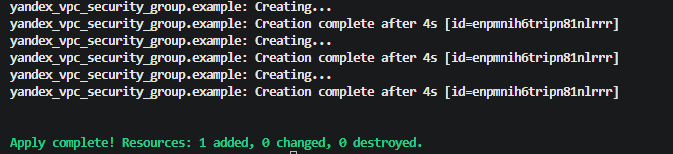

из-за ограничения квоты на количество сетей в YC, я использовала существующую сеть и подсеть через data.tf.

и создала группу безопасности с динамическими правилами.

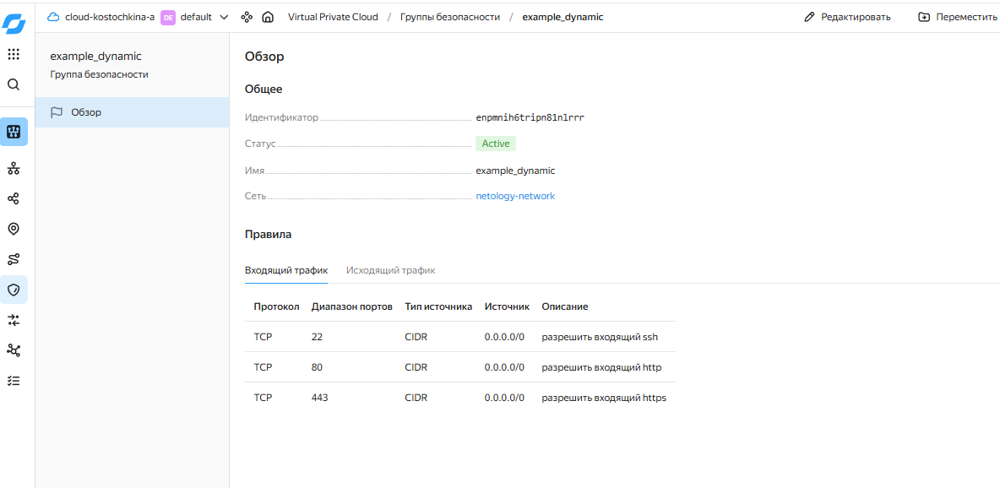

## Задание 2

### Задание 2.1

для создания 2х ВМ в YC, я использовала параметр count

создала файл count-vm.tf

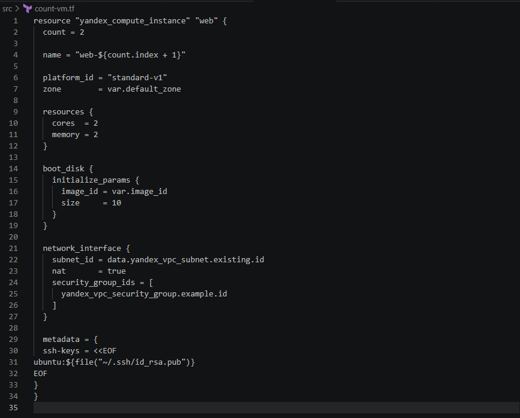

использовала уже существующую сеть через data.tf.

выполнила команды:
```docker
terraform init
terraform plan
terraform apply
```
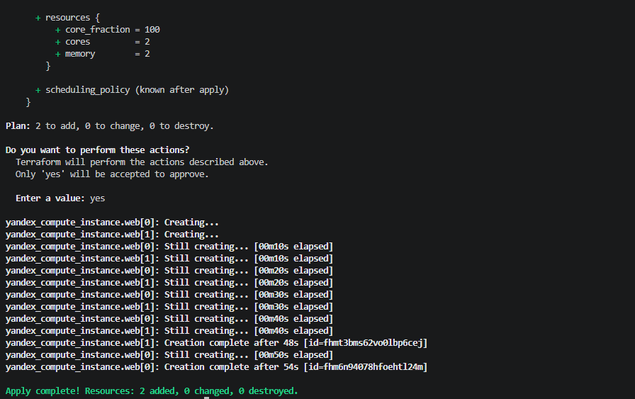

в результате было создано 2 ВМ: web-1 и web-2

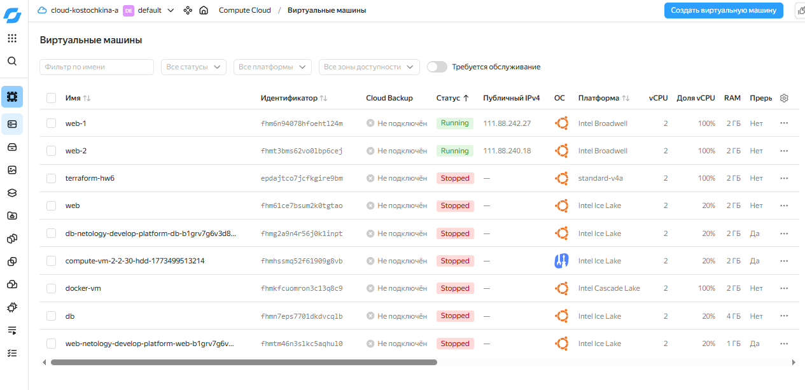

обе машины в зоне ru-central1-a, имеют публичный ip, и в статусе running. 

### Задание 2.2

создала переменные vm_list типа map(object) в новом файле for_each-vm.tf

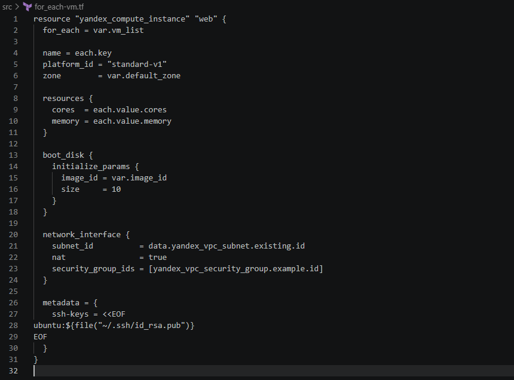

rоманда terraform apply создала две ВМ: web-1 и web-2

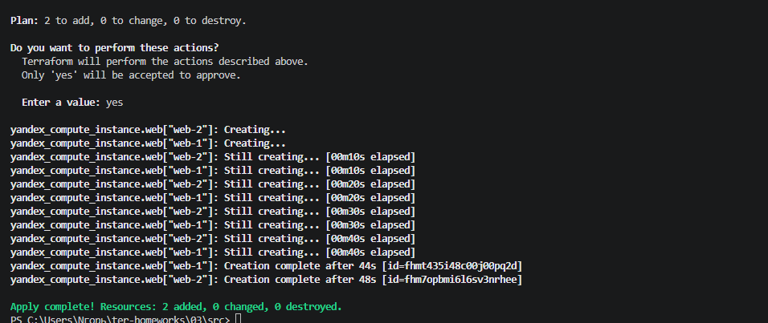

обе машины развернуты в зоне ru-central1-a и в статусе running

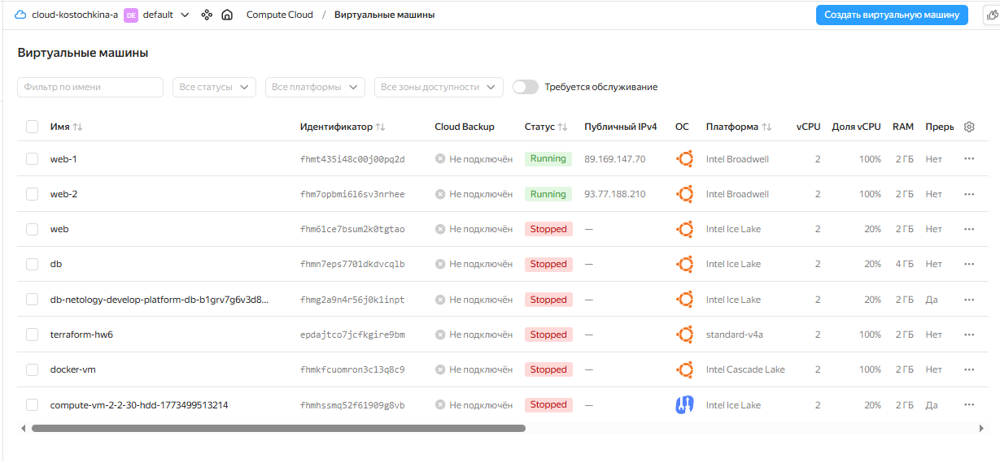

### Задание 2.4

ВМ main и replica (for_each)

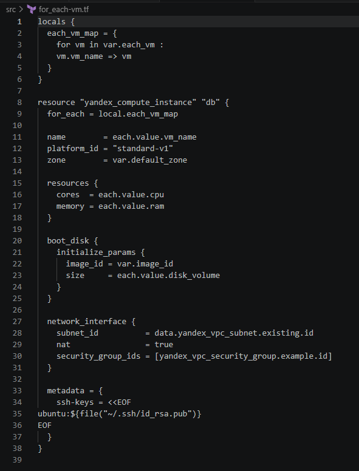

ВМ web-1 и web-2 (count)

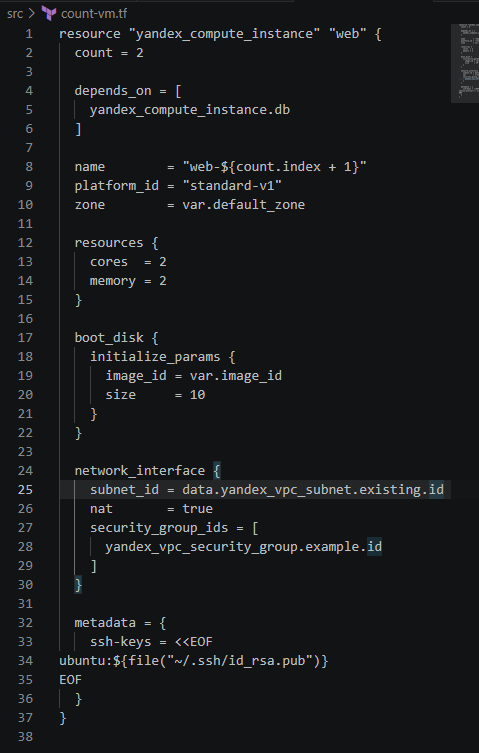

добавила запись зависимости:
```docker
depends_on = [
  yandex_compute_instance.db
]
```

в итоге выполняется последовательное создание db → web.

### Задание 2.5

добавила переменную в файл variables.tf
```docker
locals {
  ssh_key = "ubuntu:${file("~/.ssh/id_rsa.pub")}"
}
```

в metadata:
```docker
metadata = {
  ssh-keys = <<EOF
${local.ssh_key}
EOF
}
```

проинициализировала проект 
```docker
terraform init
terraform plan
terraform apply
```

## Задание 3

создала 3 одинаковых диска через count в файле disk_vm.tf
```docker
resource "yandex_compute_disk" "storage" {
  count = 3
  name  = "storage-disk-${count.index + 1}"
  size  = 1
  type  = "network-hdd"
  zone  = var.default_zone
}
```

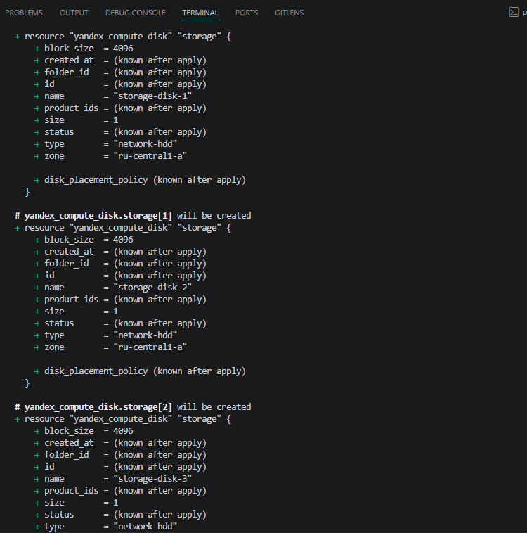

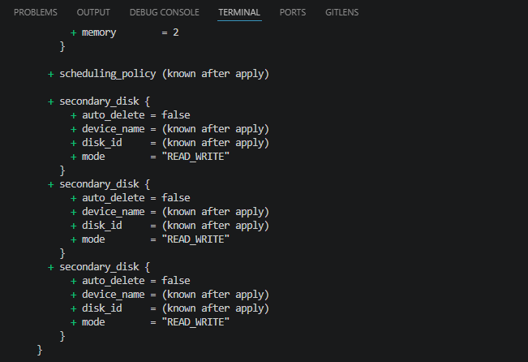

## Задание 4

создала ansible.tf и hosts.tftpl
провела форматирование и проверку, выполнила terraform apply. После того, как отработал запрос, сформировался файл hosts.ini 

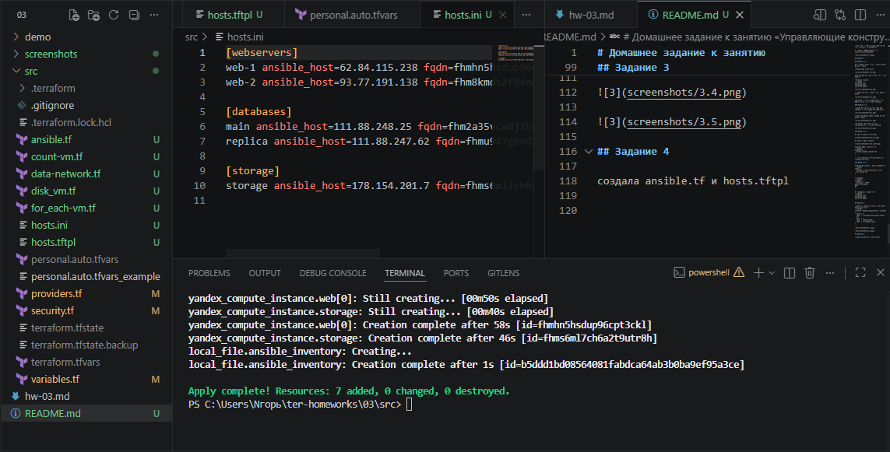


